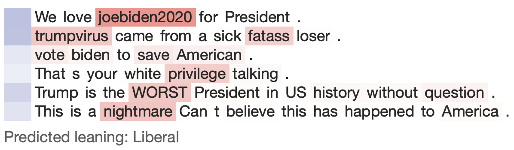

# HNATT

Our HNATT model is built to predict the user political leaning given a set of comments they have posted.
Our code was modified from the inspiring [hnatt](https://github.com/minqi/hnatt) code base.



### Overview
HNATT is a deep neural network for document classification. It learns hierarchical hidden representations of documents at word, sentence, and document levels. At both the word and sentence levels, HNATT makes use of an attention mechanism, in which it learns a context vector that determines a relevance weighting for its learned encoding of words and sentences. This model has been shown to outperform hierarchical models without attention, indicating that learning an input-dependent weighting across the various substructures of the document leads to improved performance in classification tasks.

### Content
| filename | description |
| ---: | :--- |
| `hnatt.py` | Main HNATT implementation with custom Attention layer |
| `util.data.py` | Data loader of training and unseen data |
| `util.text_util.py` | Utility function for normalizing texts |
| `util.glove.py` | Utility function for loading [GloVe embedding](http://nlp.stanford.edu/data/glove.6B.zip) weights |
| `train_hnatt_model.py` | Train HNATT model with 5-fold cross-validation on 162,102 seed users |
| `predict_unseen.py` | Predict user leaning for 9M unseen users |
| `predict_new_user.py` | Predict user leaning for a new user |
| `app/` | A simple Flask app for exploring a trained HNATT, allowing you to easily make predictions based on a text input and visualize the resulting attention activations at both word and sentence levels |

### Get started
The HNATT code was developed and tested on Python 2.7. 
Follow the instructions below to create a new Python 2.7 environment:
```bash
conda create --name py2 python=2.7
conda activate py2
python -V
pip -V
pip install virtualenv
pip install -r requirements.txt
```

Next time, just run
```bash
conda activate py2
```
to activate the Python 2.7 environment.

### Predict the political leaning of a new user
First, download our [trained models](https://dataverse.harvard.edu/dataset.xhtml?persistentId=doi:10.7910/DVN/KF5JC5) and extract the files by 
```bash
tar xvfj trained_HAN_models.tar.bz2
mv trained_HAN_models/* saved_models/
```

Next, put all extracted files into the directory [saved_models](/hnatt/saved_models), and load our trained models.
We have five trained model `cv1_hnatt_model` to `cv5_hnatt_model`, you can design your own rule for aggregating the prediction results.
```python
from hnatt import HNATT

SAVED_MODEL_DIR = 'saved_models'
saved_model_filename = 'cv1_hnatt_model.h5'
saved_tokenizer_filename = 'cv1_hnatt_model.h5.tokenizer'

# initialize HNATT
h = HNATT()
h.load_weights(SAVED_MODEL_DIR, saved_model_filename, saved_tokenizer_filename)
```

The input is a set of comments, we need do some text processing first.
Basically, we remove all punctuations within a comment, and then concatenate all comments by dot.
```python
import re
# a user posts several comments, each comment consists of several words
comments = ["It is what it is or they were nevertrumpists so they didn't like me and I don't know them",
            'vote biden to save American',
            'We love #joebiden2020 for President.',
            '#bluewave2020 BUT PREP FOR TRUMP PUTIN CIVIL WAR',
            'trumpvirus came from a sick fatass loser',
            'trump has changed his tune about the corona trumpvirus. because trumpist are kicking the bucket']

# remove punctuations from each comment, and then join them by dot
comments = [re.sub(r'[^\w\s]', ' ', x).strip() for x in comments]
comments = '. '.join(comments)
```

Now you're ready to classify the new set of comments:
```python
prob_lib, prob_con = h.predict_texts(comments)[0]
if prob_con <= 0.05:
    print('Predicted leaning: Liberal, prob_lib: {0:.4f}, prob_con: {1:.4f}'.format(prob_lib, prob_con))
elif prob_con >= 0.95:
    print('Predicted leaning: Conservative, prob_lib: {0:.4f}, prob_con: {1:.4f}'.format(prob_lib, prob_con))
else:
    print('Predicted leaning: Unknown, prob_lib: {0:.4f}, prob_con: {1:.4f}'.format(prob_lib, prob_con))
```

The above example input will print
```text
Predicted leaning: Liberal, prob_lib: 1.0000, prob_con: 0.0000
```

### Visualizing attention
Once you train an HNATT model and save it locally using the `saved_model_dir` and `saved_model_filename` arguments to `train`, you can easily play with the saved model in an interactive web app by running the following:
```python
python run_hnatt_viewer.py
```
You can then visit `localhost:5000` to interact with your HNATT.
